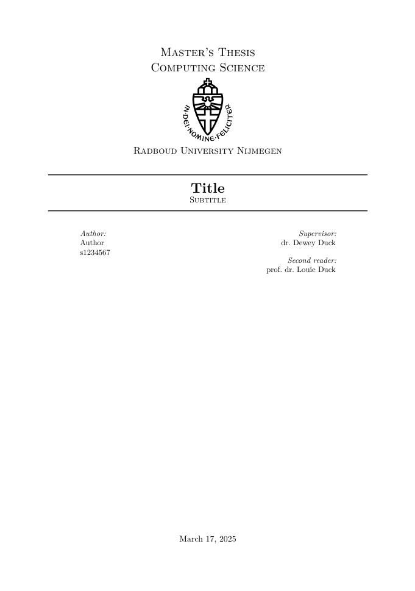
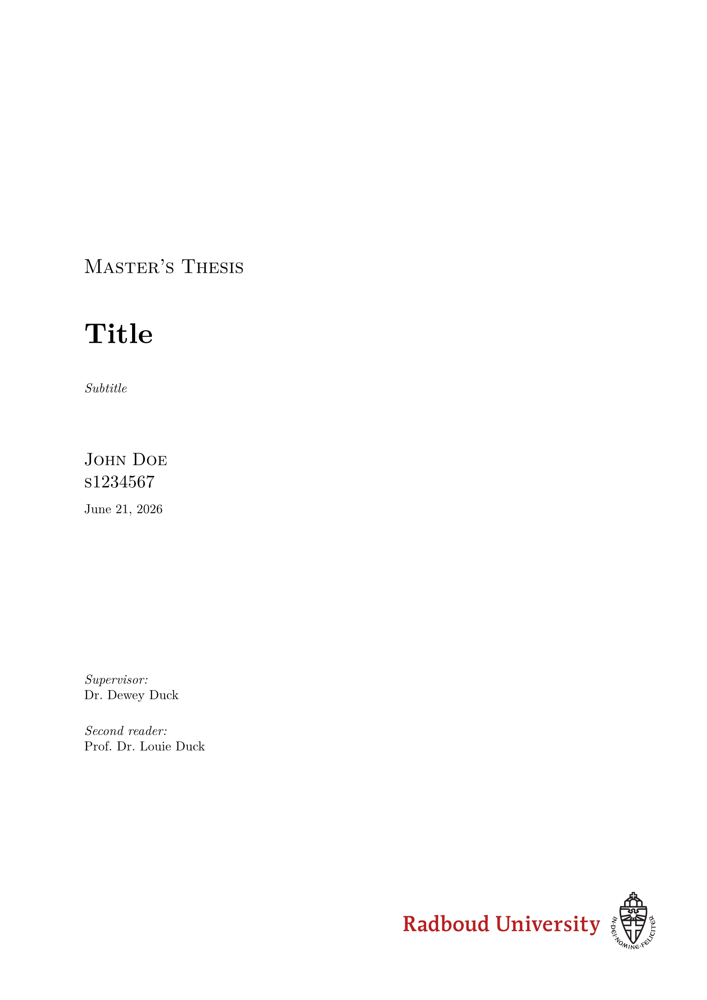

# Radboud Thesis Template

<p align="center">
    
    
</p>

Template for Radboud University Bachelor's/Master's thesis

Title page based on LaTeX package https://ctan.org/pkg/rutitlepage

## Example Usage
```typ
#import "@preview/now-radboud-thesis:0.2.0": radboud-thesis, appendix, titlepage

#titlepage(
  title: title,
  subtitle: [Subtitle],
  author: "John Doe\ns1234567",
  others: (
    (role: "Supervisor:", name: "Dr. Dewey Duck"),
    (role: "Second reader:", name: "Prof. Dr. Louie Duck"),
  ),
  course: [Master’s Thesis],
  colour: true,
  dutch: false,
)

#show: radboud-thesis.with(
  abstract: lorem(300),
  title: title,
  author: "John Doe",
)

#outline()

= Introduction
#lorem(100)
#bibliography("bibliography.bib", style: "association-for-computing-machinery")

#show: appendix

= Proofs
#lorem(100)
```
